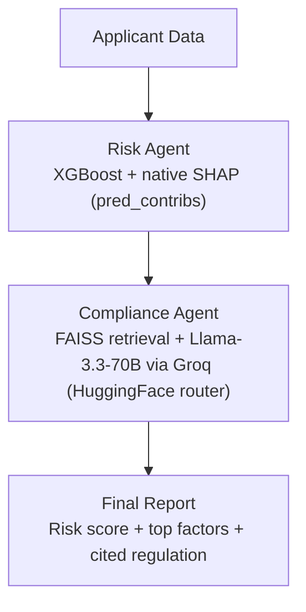

# Sentinel — Agentic Credit Underwriting & Compliance System

> An explainable, multi-agent AI system for automated credit risk
> assessment and SBP regulatory compliance — combining XGBoost risk
> scoring, SHAP explainability, and a RAG-powered compliance agent,
> orchestrated via LangGraph.

**Final Year Project** — Computational Finance, NED University of Engineering & Technology.

---

## Overview

Manual loan underwriting is slow, inconsistent, and hard to audit. Sentinel
automates the process end-to-end: it scores an applicant's default risk,
**explains** exactly why it reached that score (SHAP), and cross-checks the
decision against real **State Bank of Pakistan (SBP)** consumer financing
regulations — all coordinated by a multi-agent pipeline instead of a single
black-box model.

## Architecture



- **Risk Agent** — a tuned XGBoost classifier predicts default probability
  and returns the top SHAP-attributed risk factors for that applicant.
- **Compliance Agent** — a RAG pipeline retrieves the most relevant SBP
  regulation(s) for the decision and asks an LLM to explain them in plain
  language, citing the regulation number.
- **Orchestrator** (LangGraph) — runs both agents in sequence and merges
  their output into one report.

## Tech Stack

| Layer | Tools |
|---|---|
| Data processing | PySpark |
| Model training | XGBoost, Optuna (hyperparameter search), scikit-learn |
| Experiment tracking | MLflow (SQLite backend) |
| Explainability | XGBoost native `pred_contribs` (Tree SHAP), matplotlib/seaborn |
| Embeddings | `sentence-transformers` (`all-MiniLM-L6-v2`) |
| Vector search | FAISS |
| LLM | Llama-3.3-70B-Instruct via Groq, called through HuggingFace's `InferenceClient` |
| Orchestration | LangGraph |
| UI | Streamlit |

## Dataset

**[Default of Credit Card Clients](https://archive.ics.uci.edu/dataset/350/default+of+credit+card+clients)**
— UCI Machine Learning Repository (id=350). 30,000 Taiwanese credit card
clients, 23 features spanning demographics, six months of payment status,
bill amounts, and payment amounts. Target: default on next month's payment.

Six additional features were engineered from the raw payment history
(utilization ratio, average/maximum payment delay, months late, payment
ratio, delay trend) before training.

## Results

| Metric | Value |
|---|---|
| Naive baseline (majority class) | 77.9% |
| Accuracy | 78.6% |
| Precision | 51.5% |
| Recall | 58.3% |
| F1 | 0.547 |
| **ROC-AUC** | **0.781** |

The ROC-AUC held steady at ~0.78 across every tuning attempt (narrower
search, wider search, different train/test splits), which lines up with
independently published results using XGBoost on this same dataset
(reported AUCs of 0.780–0.788). This appears to be close to the dataset's
genuine signal ceiling rather than a tuning shortfall — see
[Known Limitations](#known-limitations-and-future-work).

The decision threshold (0.55) was chosen over the OOF-optimal value found
during training because it gives meaningfully higher recall — in credit
risk, a missed defaulter is typically costlier than a wrongly-flagged good
applicant.

## Project Structure

```
.
├── data/
│   ├── raw/                     # Source dataset (downloaded via ucimlrepo)
│   ├── processed/                # Cleaned, feature-engineered train/test splits
│   └── knowledge_base/           # SBP regulation source text, chunks, FAISS index
├── models/
│   └── credit_model.pkl          # Trained XGBoost model + decision threshold
├── reports/                      # EDA charts, confusion matrix, SHAP plots
├── src/
│   ├── spark/
│   │   ├── spark_session.py      # PySpark session (pins Java 17 explicitly)
│   │   ├── EDA.py                # Exploratory data analysis
│   │   └── preprocessing.py      # Cleaning, feature engineering, stratified split
│   ├── models/
│   │   ├── train.py              # Optuna-tuned XGBoost training + MLflow logging
│   │   ├── threshold.py          # Decision-threshold analysis and override
│   │   └── explainability.py     # SHAP global + per-applicant explanations
│   ├── rag/
│   │   ├── ingest_documents.py   # Chunks the SBP regulation source by regulation
│   │   ├── build_vectorstore.py  # Embeds chunks, builds the FAISS index
│   │   ├── query_rag.py          # Retrieval-only test harness
│   │   └── generate_answer.py    # Retrieval + LLM answer generation
│   └── agents/
│       └── orchestrator.py       # LangGraph: Risk Agent + Compliance Agent
├── streamlit_app.py               # Dashboard: regulation search + report gallery
├── requirements.txt
└── .env                           # GROQ_API_KEY (not committed — see .gitignore)
```

## Setup

```bash
python -m venv venv
venv\Scripts\activate          # Windows
pip install -r requirements.txt
pip install torch==2.2.2 --index-url https://download.pytorch.org/whl/cpu
```

Create a `.env` file in the project root:

```
GROQ_API_KEY=your_key_here
```

Get a free key at [console.groq.com](https://console.groq.com).

## Usage

```bash
# 1. Data pipeline
cd src && python data_ingestion.py
cd spark && python preprocessing.py

# 2. Train the risk model
cd ../models && python train.py
python threshold.py               # review + lock the decision threshold

# 3. Explainability
python explainability.py          # generates SHAP charts + sample explanations

# 4. RAG knowledge base
cd ../rag && python ingest_documents.py
python build_vectorstore.py
python query_rag.py               # sanity-check retrieval

# 5. Full agent pipeline
cd ../agents && python orchestrator.py

# 6. Dashboard
cd ../.. && streamlit run streamlit_app.py
```

## Known Limitations and Future Work

- **Accuracy ceiling**: ~0.78 ROC-AUC appears to be close to this dataset's
  genuine limit — independently published work on the same dataset reports
  a similar range. More data or features are unlikely to move this much
  without risking overfitting on a dataset this size.
- **Regulation currency**: the SBP source document is the August 2016
  compiled booklet. Some figures (e.g. the Debt Burden Ratio) have likely
  been amended by later circulars not yet folded into that compilation —
  noted directly in `data/knowledge_base/sbp_consumer_financing_source.txt`.
  A production system would need a circular-tracking layer.
- **Source access**: SBP's site blocks automated PDF downloads, so the
  regulation text is a manually-verified local cache rather than a live
  scrape — documented for reproducibility in the same source file.
- **Planned next**: a Data Agent to complete the three-agent design from
  the original architecture, and DVC for dataset/model versioning.

## Author

Sharjeel — Computational Finance, NED University of Engineering & Technology.
"# Agentic-Credit-Underwriting-Compliance-System" 
